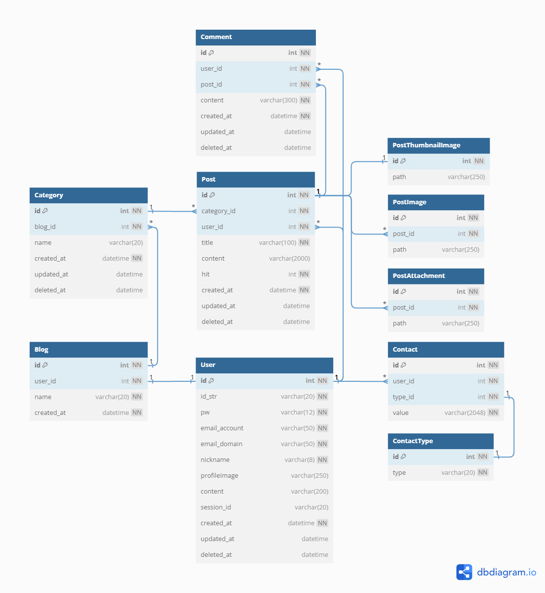
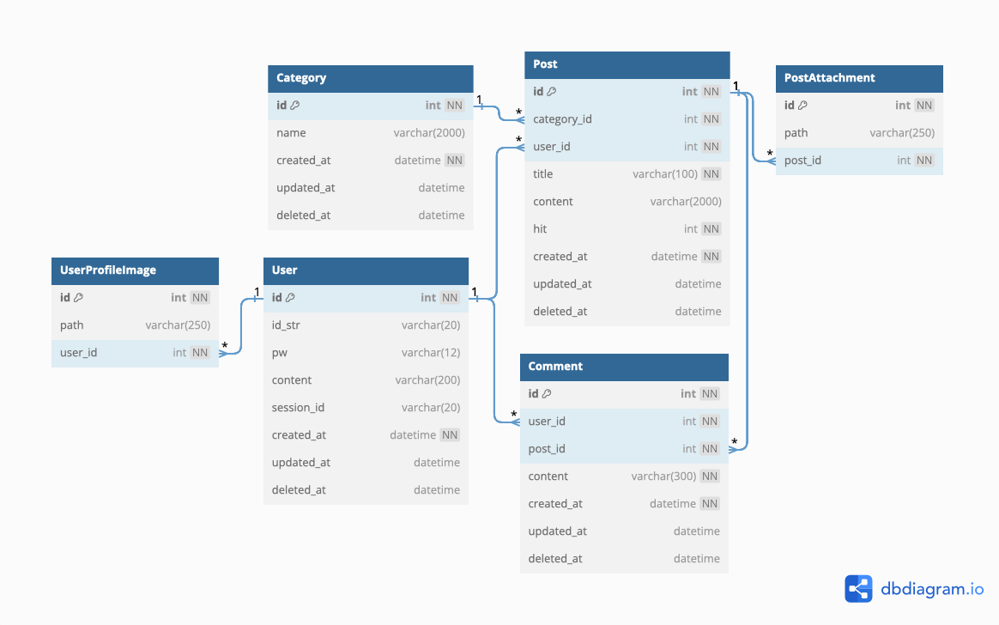

# ERD

## 2023.12.16

 

### 🔄변경 사항

1. `User` 테이블 - 유저명을 넣을 수 있는 `nickname` 필드를 추가했습니다. - 유저 프로필 사진을 넣을 수 있는 `profileImage` 필드를 추가했습니다.
     
2. `Category` 테이블 - 카테고리 명(`name`) 글자수 2000 -> 20자로 수정했습니다.
     
3. `PostImage` 테이블 추가 - 글 내용 안에 추가되는 이미지를 저장하는 테이블입니다.
     
4. `Blog` 테이블 추가 - 블로그 이름을 관리할 수 있습니다. - 한 유저가 여러 개의 블로그를 생성할 수 있기 때문에 필요합니다.
     
5. `PostThumbnailImage` 테이블 추가 - 글 마다 썸네일을 관리할 수 있습니다.  
    
6. `Contact` 테이블, `ContactType` 테이블 추가 - 이메일, 깃허브, 링크드인 같은 연락처 정보를 관리하는 테이블입니다.
     
7. `UserProfileImage` 테이블 제거
   - `user`와 `profile` 이미지 테이블은 1:1 관계이기 때문에 테이블을 분리할 필요가 없다고 판단하여 제거하였습니다.

 

## 2023.12.04

- 테이블 설계 초기 버전
