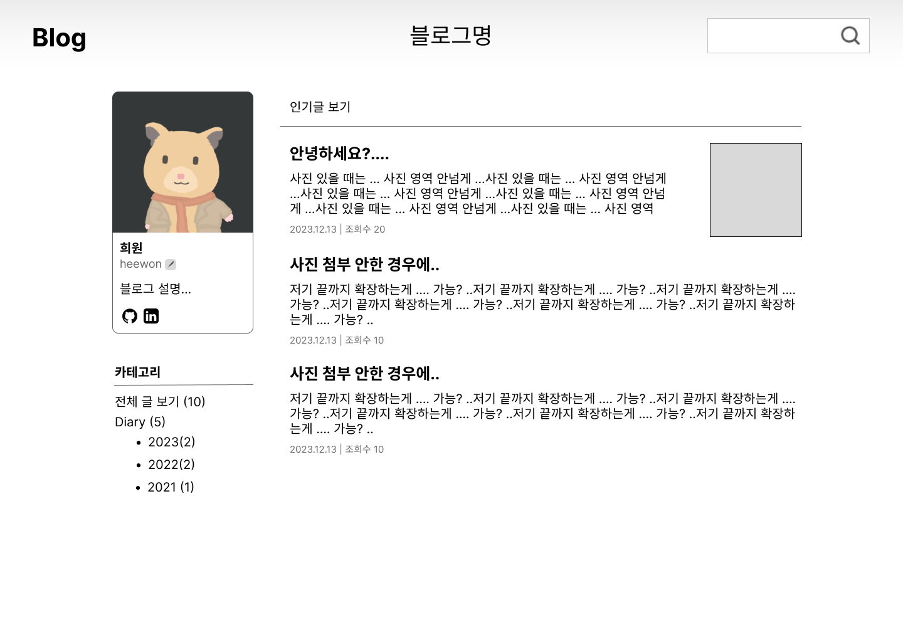
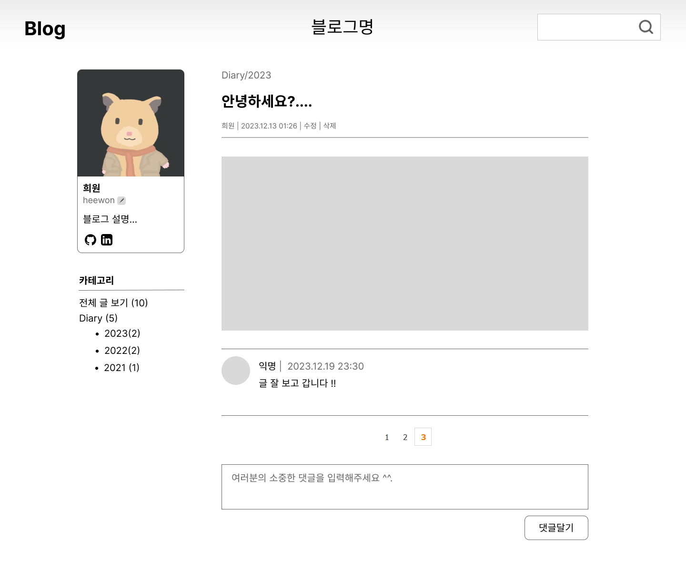

# 화면설계서

## 메인 화면

 

- 메인으로 인기글을 내림차순으로 보여줍니다.
- 왼쪽 프로필 영역
  - 블로그 주인의 닉네임, 아이디를 기본으로 보여줍니다.
  - 블로그 설명, github 등 링크를 추가할 수 있습니다.
- 카테고리 영역
  - 카테고리명 오른쪽에 해당 카테고리에 쓴 글의 개수를 보여줍니다.
- 오른쪽 상단에는 글을 검색할 수 있는 검색창이 있습니다.

 

## 글 목록 화면

 

- 선택한 카테고리의 글 목록을 최신순으로 보여줍니다.
- 오른쪽 상단의 글 작성 버튼으로 글을 작성할 수 있습니다.

 

## 글 상세보기 화면

### 로그인 한 경우 (해당 블로그 주인인 경우)

 

- 로그인 한 경우

  - 해당 글의 수정, 삭제 버튼이 활성화 되어있습니다.
  - 해당 글에 댓글을 달 수 있습니다.

- 로그인 하지 않은 경우
  - 이름과 암호를 적어 댓글을 작성할 수 있습니다.

 

## 글 수정 및 작성 화면

 

## 로그인 화면

